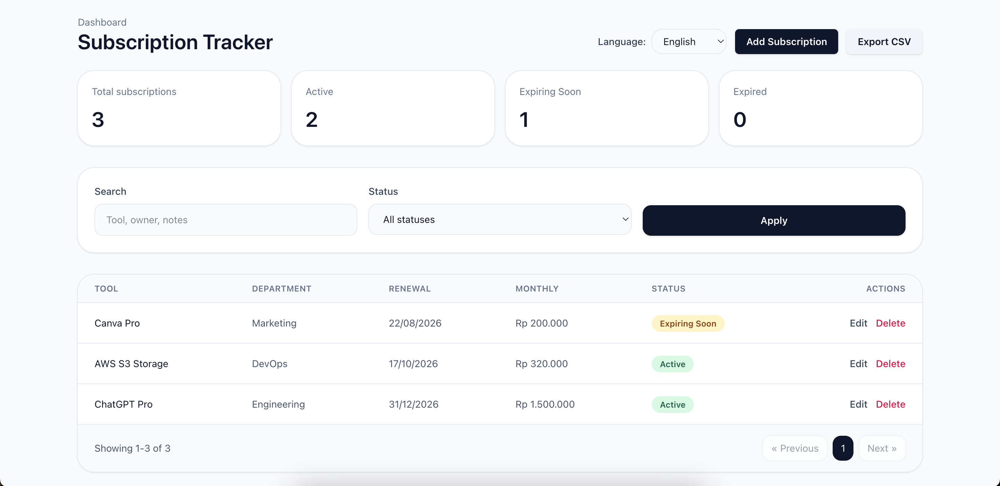

# Tools Subscription & Renewal Tracker

Aplikasi manajemen subscription sederhana dengan Laravel backend dan React frontend.

## Fitur

- CRUD subscription
- Filter dan pagination
- Export CSV
- Status: `Active`, `Expiring Soon`, `Expired`, `Cancelled`

## Struktur

- `app/Models/Subscription.php`
- `app/Http/Controllers/SubscriptionController.php`
- `app/Http/Requests/SubscriptionRequest.php`
- `database/migrations/2026_06_26_103916_create_subscriptions_table.php`
- `resources/js/Pages/Subscriptions/`
- `routes/web.php`

## Setup

1. `composer install`
2. `npm install`
3. `cp .env.example .env`
4. `php artisan key:generate`
5. `php artisan migrate`

## Jalankan

- Backend: `php artisan serve`
- Frontend: `npm run dev`

## Hasil

_Buka https://elgibranleadgeeks.demoproject.my.id di browser._
